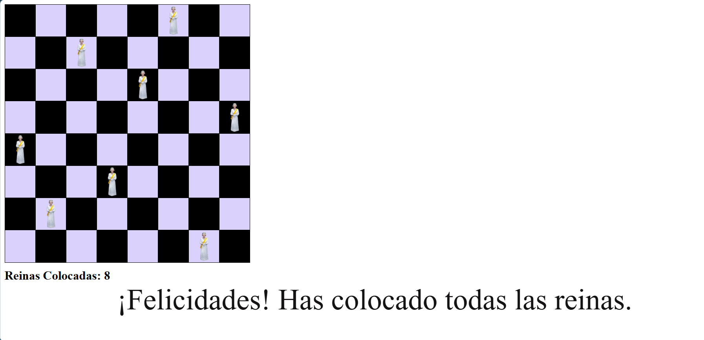

# Juego 8 Reinas

## 📋 Descripción General

**8 Reinas** es una aplicación web interactiva que implementa el clásico problema de las 8 reinas del ajedrez. El objetivo es colocar 8 reinas en un tablero de ajedrez 8x8 de tal manera que ninguna reina ataque a otra (es decir, no pueden compartir la misma fila, columna o diagonal).

**Repositorio:** [Itzel921/8reinas](https://github.com/Itzel921/8reinas)

### Composición de Lenguajes
- **HTML:** 63.7%
- **JavaScript:** 30.7%
- **CSS:** 5.6%

---

## 🎯 Características Principales

### 1. **Tablero Interactivo 8x8**
- Tablero de ajedrez con colores alternados (negro y púrpura)
- Cada celda es clickeable para colocar reinas
- Visualización en tiempo real del estado del juego

### 2. **Colocación de Reinas**
- El usuario puede hacer clic en cualquier celda para colocar una reina
- Se muestran imágenes de reinas en las celdas seleccionadas
- Contador en tiempo real de reinas colocadas (máximo 8)

### 3. **Validación de Reglas de Ajedrez**
- **Bloqueo Horizontal:** Se bloquean las celdas en la misma fila
- **Bloqueo Vertical:** Se bloquean las celdas en la misma columna
- **Bloqueo Diagonal:** Se bloquean las celdas en ambas diagonales

### 4. **Validación Visual**
- Al pasar el ratón sobre una celda, se resaltan en rojo todos los cuadros que atacaría una reina
- Permite al usuario ver visualmente qué celdas estarían bajo ataque

### 5. **Retroalimentación del Usuario**
- Contador que indica cuántas reinas se han colocado
- Mensaje de felicitación al completar el reto (8 reinas colocadas)
- Posibilidad de remover reinas haciendo clic nuevamente

---

## 🎮 Cómo Usar

### Paso 1: Tablero Inicial
El tablero comienza vacío, listo para que el usuario coloque las reinas.
**Instrucciones:**
- Haz clic en cualquier celda del tablero para colocar una reina
- La reina aparecerá como una imagen en la celda seleccionada

### Paso 2: Validación Visual
- Pasa el ratón sobre las celdas para ver cuáles quedarían bajo ataque (mostradas en rojo)
- Las celdas atacadas por una reina ya colocada se bloquean automáticamente

### Paso 3: Ganar el Juego
Cuando hayas colocado exitosamente las 8 reinas:
- El contador mostrará "Reinas Colocadas: 8"
- Aparecerá el mensaje: "¡Felicidades! Has colocado todas las reinas."

---

## 📜 Reglas del Juego
- Colocar **8 reinas** en un tablero 8x8.
- Ninguna reina puede atacar a otra:
  1. No pueden estar en la misma fila.
  2. No pueden estar en la misma columna.
  3. No pueden estar en la misma diagonal.
- **Sistema automático:** El juego bloquea automáticamente las celdas que violarían estas reglas.
- **Remover reinas:** Haz clic en una reina colocada para removerla.

  ---

## 🚀 Tecnologías Utilizadas

| Tecnología | Versión | Uso |
| :--- | :--- | :--- |
| **HTML5** | Estándar | Estructura del documento |
| **CSS3** | Estándar | Estilos visuales |
| **JavaScript (Vainilla)** | ES6 | Lógica del juego |

--- 

  ### 👤 Autor
Itzel921

### 🗓️ Última Actualización
Septiembre 5, 2026

---
